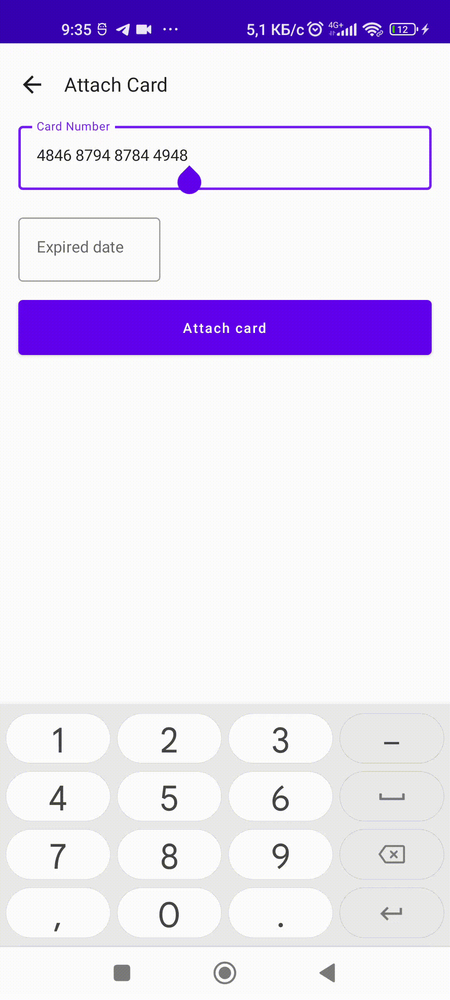

# A simple library for credit card number and expired data mask

In mobile wallets offen developers need to format credit card number and expired data with jetpack compose we can easyly implement it 

Setup
-----
To try out this sample app, you need to at least use the latest version
of Android Studio. This project has been tested against Android Studio Artic Fox.
[You can download it here](https://developer.android.com/studio/preview).
In general, Jetpack Compose requires you to use the Canary version of
Android Studio.

Examples
-----------------

Each example is meant to be self contained and tries to explain all the
concepts that its using with comments. Compose also comes with this
nifty feature that lets you preview each component in the IntelliJ IDE
itself. To do so, go to any of the examples and then click on
the preview button in the top right corner. This is possible if your
`@Composable` component has a corresponding `@Preview` method associated
with it. Look at the examples below for all this to make a bit more
sense.

### General

|Example|Preview|
|-------|-------|
|[Credit card number formatting in compose ](https://github.com/behruzbahromzoda97/CreditCardMask/blob/main/CreditCardMask/src/main/java/tj/behruz/creditcardmask/main/CardNumberMask.kt)| |
|[Credit card expired data formatting in compose ](https://github.com/behruzbahromzoda97/CreditCardMask/blob/main/CreditCardMask/src/main/java/tj/behruz/creditcardmask/main/ExpiredCardDateMask.kt#L51)|  |

License
-----------------

    Copyright 2022 Vinay Gaba

    Licensed under the Apache License, Version 2.0 (the "License");
    you may not use this file except in compliance with the License.
    You may obtain a copy of the License at

       http://www.apache.org/licenses/LICENSE-2.0

    Unless required by applicable law or agreed to in writing, software
    distributed under the License is distributed on an "AS IS" BASIS,
    WITHOUT WARRANTIES OR CONDITIONS OF ANY KIND, either express or implied.
    See the License for the specific language governing permissions and
    limitations under the License.

  
